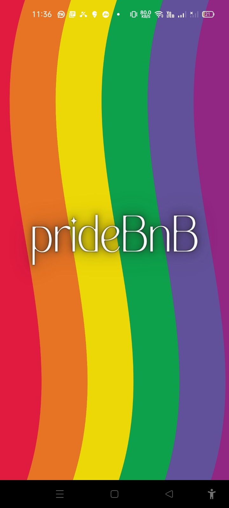
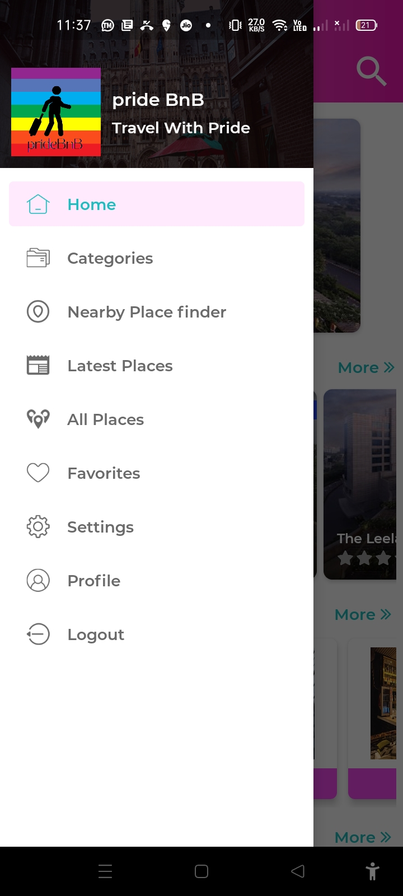
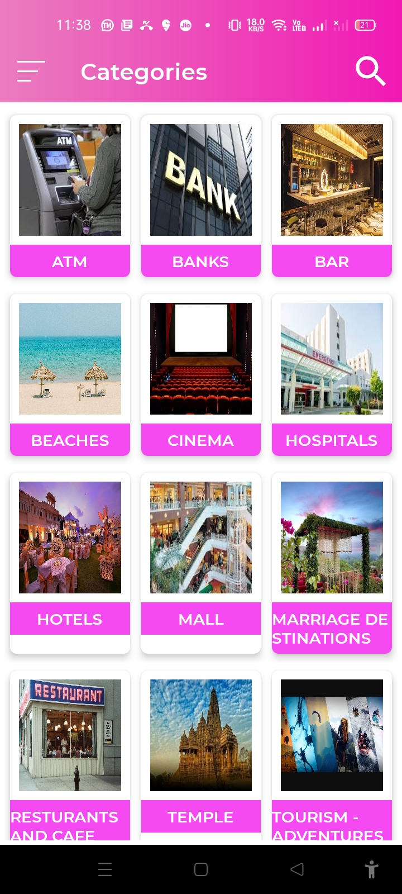
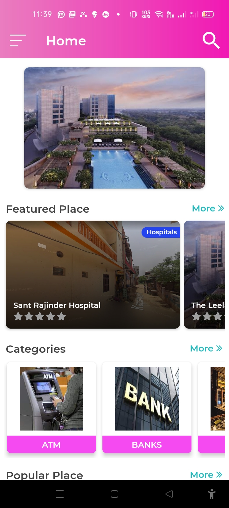
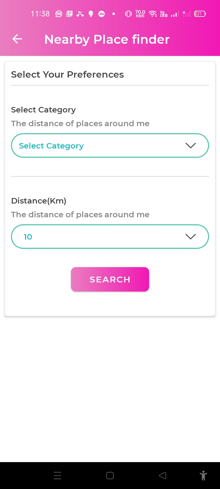
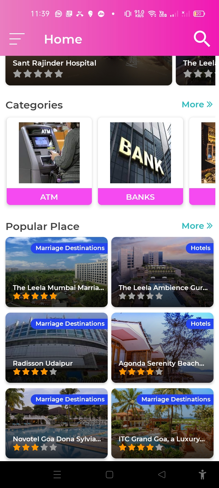
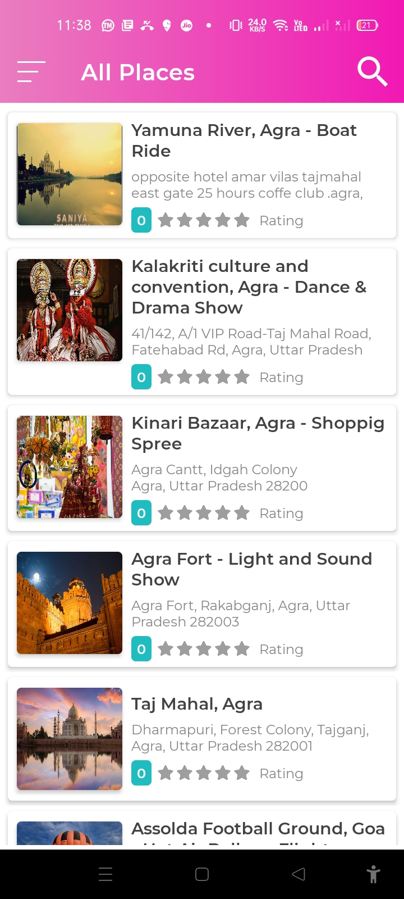

# prideBnB🌈
# [Download App Here](https://drive.google.com/file/d/11wZ_09a3Q_Dx0UdZoB4NDb7GwuoueZkc/view?usp=share_link)   
An app to assist people of LGBTQ+ communities to find hotels, places and destinations with good hospitality.

### Feature of prideBnB
- create User Profile, select "I identify as" option and explore.
- Explore various categories of Hotels, Hospitals, Places and destinations.
- Search and get the curated results of places based on ratings and review.
- Apply various filters to get desired result.
- Get information as such reviews, ratings and location.
- Get direction to booking of prefered location.
- Tap and know about the LGBTQ+ rights in different states of India.
- Write reviews and be a guide to others.

### ScreenShots of prideBnB 
<pre>
       

</pre>

## Problem it Solves

- It gives curated list of destinations based on rating where LGBTQ+ communites are welcomed.
- It is important to ensure safety and the locations recommended here are safe.
- It helps to be a part of greater facilitator in travel and tourism needs of LGBTQ+ communities.

## Challenges we faced

- Gathering the data of categories as such hotels, restaurants, dineouts, beachers, etc.
- Building the database for co-ordinates(latitude and Longitude) of the places.
- Fetching reviews and ratings.
- Plaing the searching parameters.
- integrating multiple 3rd party services like maps, booking sites was the trickiest part.

## Proposed Enhancements
- Scrapping data of hotels.
- integrating ride booking.
- Live in-app events.
- Support for connecting chain on institutions.

### Contributors
- Shashank Kumar
- Aman Gupta
- Richa Agrawal
- Shubhi Singh

Built with ❤️ by Team C.O.D.E
